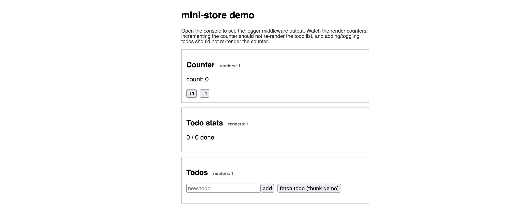

<div align="center">
  <br />

  <p align="center">
  
  </p>

  <h1>🗃️ mini-store</h1>

  <p>
    A Redux/Zustand-style state manager, built from scratch instead of imported.<br/>
    No dependencies at runtime. No dispatch boilerplate. Just the four problems<br/>
    a state library actually has to solve — implemented, tested, and compared.
  </p>

  <br />

  <div>
    
    
    
    
    
  </div>
</div>

## 📋 Table of Contents

1. 🤖 [Introduction](#introduction)
2. ⚙️ [Tech Stack](#tech-stack)
3. 🔋 [Features](#features)
4. 🤸 [Quick Start](#quick-start)
5. 🗂️ [Project Structure](#project-structure)
6. 🕸️ [Snippets](#snippets)
7. 🧠 [Architecture Notes](#architecture-notes)
8. 📌 [Known Limitations](#known-limitations)

## <a name="introduction">🤖 Introduction</a>

"How would you build your own Redux?" is a common senior/staff frontend
interview question. mini-store is that answer, in code, instead of a
whiteboard sketch.

It implements the four things any state management library actually has to
solve — hold state outside React and notify subscribers, bail out of
notifying when nothing referentially changed, let cross-cutting concerns
(logging, async actions) wrap the update path without components knowing,
and bind to React in a way that doesn't tear under concurrent rendering —
in about 200 lines, with no runtime dependency on Redux or Zustand
themselves.

It's not trying to replace either library. It's a demonstration that the
internals aren't magic: every design decision below is deliberate, and the
[comparison doc](docs/COMPARISON.md) is honest about where a production
library like Redux Toolkit or Zustand still earns its extra weight.

## <a name="tech-stack">⚙️ Tech Stack</a>

- **TypeScript** — strict mode, no `any` in the public surface
- **React 18** — the binding is built directly on `useSyncExternalStore`, not a wrapper library
- **Vite** — dev server and build for the demo app
- **Vitest** + **React Testing Library** — unit tests for the store/middleware, component tests for the React binding's render behavior

No state management library is a dependency of this project — that would rather defeat the point.

## <a name="features">🔋 Features</a>

👉 **A vanilla store** — `createStore` holds state in a closure, exposes `getState`/`setState`/`subscribe`, and skips notifying listeners when a shallow check finds nothing actually changed.

👉 **Selectors with a referential-equality bailout** — the React binding caches the last selected value so an unrelated state change doesn't re-render a component that only cares about one slice.

👉 **Composable middleware** — a `logger` that mirrors Redux DevTools-style logging, and a thunk-equivalent for async actions, both built as wrappers around `set`/`get` rather than a dispatch pipeline.

👉 **Concurrent-safe React binding** — `useStore` is built on `useSyncExternalStore`, the same primitive `react-redux` and Zustand both moved to for React 18, so it can't tear mid-render.

👉 **A render-counter demo** — the included demo app shows a live badge on every component, so you can *watch* the bailout work instead of taking it on faith.

👉 **Tested** — 24 unit and component tests cover the equality bailout, middleware composition, and the React binding's render behavior. Run with `npm test`.

## <a name="quick-start">🤸 Quick Start</a>

**Prerequisites:** [Node.js](https://nodejs.org/en) and npm.

```bash
git clone <your-repo-url>
cd mini-store
npm install
npm run dev
```

Open [http://localhost:5173](http://localhost:5173) for the demo app —
watch the render counters while you increment the counter and add/toggle
todos.

```bash
npm run build      # production build (also type-checks)
npm run typecheck  # type-check only
npm test           # run the test suite once
npm run test:watch # watch mode
```

## <a name="project-structure">🗂️ Project Structure</a>

```
src/
  core/
    createStore.ts   – the store itself: state, subscribe, set with a
                        reference-equality bailout before notifying
    middleware.ts     – logger + thunk-equivalent + compose
    shallow.ts         – default equality fn for object-shaped selections
    types.ts
  react/
    useStore.ts        – useSyncExternalStore-based binding, selector +
                          equalityFn, cached snapshot to avoid tearing
  __tests__/            – unit tests for the store, middleware, shallowEqual,
                           and the React binding (render-count assertions)
  index.ts              – public exports
demo/                   – small Vite + React app exercising all of the above
docs/COMPARISON.md      – trade-offs vs Redux Toolkit and Zustand
```

## <a name="snippets">🕸️ Snippets</a>

<details>
<summary><code>src/core/createStore.ts</code> — the reference-equality bailout</summary>

The part that's easy to build wrong: `setState` only notifies listeners if a
shallow check finds something actually changed, so downstream selectors and
React's own `Object.is` check have something real to bail out against.

```typescript
const setState: SetState<T> = (partial, replace = false) => {
  const nextPartial = typeof partial === "function" ? partial(state) : partial;
  if (nextPartial === state) return;

  const nextState = replace ? (nextPartial as T) : { ...state, ...nextPartial };
  if (Object.is(nextState, state)) return;

  let changed = replace;
  if (!replace) {
    for (const key of Object.keys(nextPartial) as (keyof T)[]) {
      if (!Object.is(nextState[key], state[key])) {
        changed = true;
        break;
      }
    }
  }

  state = nextState;
  if (changed) listeners.forEach((listener) => listener());
};
```

</details>

<details>
<summary><code>src/react/useStore.ts</code> — why <code>useSyncExternalStore</code>, not <code>useState</code> + <code>useEffect</code></summary>

React 18's concurrent renderer can render a component multiple times for one
commit while a different update to the same external store happens in
between. A `useState`/`useEffect` subscription re-syncs *after* commit —
exactly the window where two components can end up rendering against two
different snapshots of the same store ("tearing"). `useSyncExternalStore`
reads the snapshot during render itself and forces a sync re-render if it
detects a mismatch — a guarantee userland code can't replicate pre-React 18.

```typescript
export function useStore<T extends object, S = T>(
  api: StoreApi<T>,
  selector: (state: T) => S = (state) => state as unknown as S,
  equalityFn: EqualityFn<S> = Object.is
): S {
  const cache = useRef<{ state: T; selected: S } | null>(null);

  const getSnapshot = useCallback((): S => {
    const state = api.getState();
    const prev = cache.current;
    if (prev && prev.state === state) return prev.selected;

    const selected = selector(state);
    if (prev && equalityFn(prev.selected, selected)) {
      cache.current = { state, selected: prev.selected };
      return prev.selected; // same reference — useSyncExternalStore sees "no change"
    }
    cache.current = { state, selected };
    return selected;
  }, [api, selector, equalityFn]);

  return useSyncExternalStore(api.subscribe, getSnapshot, getServerSnapshot);
}
```

</details>

<details>
<summary><code>src/core/middleware.ts</code> — middleware without a dispatch pipeline</summary>

Redux's middleware signature exists because dispatch is a single funnel;
middleware composes around that funnel. This store has no such funnel, so
`logger` instead wraps the `set`/`get` pair passed into the state creator
before user code ever sees them — same job, smaller mechanism:

```typescript
export function logger<T extends object>(config: StateCreator<T>): StateCreator<T> {
  return (set, get, api) => {
    const loggedSet: SetState<T> = (partial, replace) => {
      const prev = get();
      set(partial, replace);
      const next = get();
      if (prev !== next) {
        console.groupCollapsed(`[mini-store] setState`);
        console.log("prev:", prev, "next:", next);
        console.groupEnd();
      }
    };
    return config(loggedSet, get, api);
  };
}
```

</details>

## <a name="architecture-notes">🧠 Architecture Notes</a>

**Why no action/reducer layer?** Redux Toolkit centers on
`dispatch(action) -> reducer(state, action)`. That indirection buys a
serializable log of every state transition, which is what makes DevTools'
time-travel replay possible. mini-store (like Zustand) skips it — `set`
merges directly, callable from anywhere without funneling through a
dispatch table. You lose the audit log; you gain no boilerplate. See
[`docs/COMPARISON.md`](docs/COMPARISON.md) for the full trade-off, including
where Redux's funnel is worth it.

**Why does the thunk middleware barely do anything?** RTK's thunk
middleware exists because Redux's `dispatch` only accepts plain objects by
default, so the middleware special-cases functions. mini-store's `set`/`get`
are already just closures, so any async function can call them directly with
zero middleware — `withThunk` here documents that convention more than it
enforces one. That's a real simplification, not a missing feature.

**Why is there a test suite for a from-scratch project?** The whole point of
this project is proving specific claims — "the selector bailout actually
bails out," "a listener throwing doesn't break other listeners" — so those
claims are asserted in `src/__tests__`, not just described in comments. No
CI workflow is wired up yet; `npm test` runs locally.

## <a name="known-limitations">📌 Known Limitations</a>

These are deliberate scope decisions, not oversights — see
[`docs/COMPARISON.md`](docs/COMPARISON.md) for the reasoning behind each:

- **No DevTools / time-travel** — there's no serializable action stream to replay, since there's no action layer at all.
- **No async data-fetching layer** — no request dedup, cache invalidation, or refetch-on-focus the way RTK Query provides. Async actions here are plain closures over `set`/`get`.
- **Shallow equality only** — the selector bailout is a one-level shallow compare; no deep-equality option is built in.
- **No persist/devtools middleware ecosystem** — Zustand ships these as optional add-ons; mini-store would need them hand-written.
